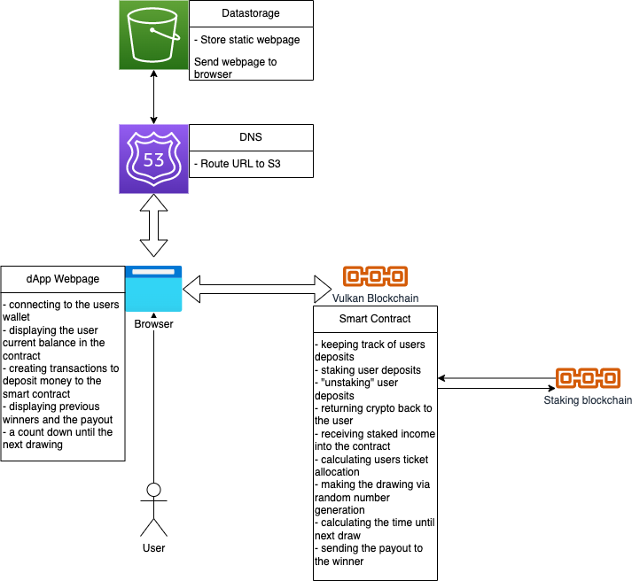

# Save a Million Lottery

Save a million lottery is a dApp where users can deposit crypto and earn large rewards for doing so. You can withdraw your crypto at anytime and still have a chance of earning a reward. Crypto deposits are staked for yield and the proceeds of this staking are pooled together. At regular intervals a winner is choosen based on the time and value of crypto staked who will take a share of the staked reward. This mean your inital deposit is safe. You can't lose!

# Network Gateway and S3

This is used to serve the static webpage to the user. This static page contains the UI and javascript to intercts with the smart contract. This static page will run thin the user browser.

# User Browser

Everything in thei dApp runs client side, for transaparency reasons. The users browers is responsible for executing all code and interacting with the smart contract including:

- connecting to the users wallet
- displaying the user current balance in the contract
- creating transactions to deposit crypto to the smart contract
- displaying previous winners and the payout
- a count down until the next drawing

# Smart Contract

The smart contract is acting like a backend for the dApp reposible for:

- keeping track of users deposits
- staking user deposits
- "unstaking" user deposits
- returning crypto back to the user
- receiving staked income inot the contract
- calculating users ticket allocation
- making the drawing via random number generation
- calculating the time until next draw
- sending the payout to the winner

